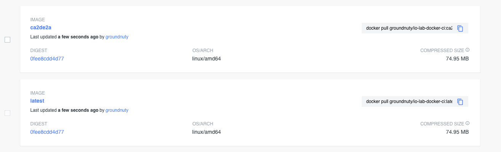
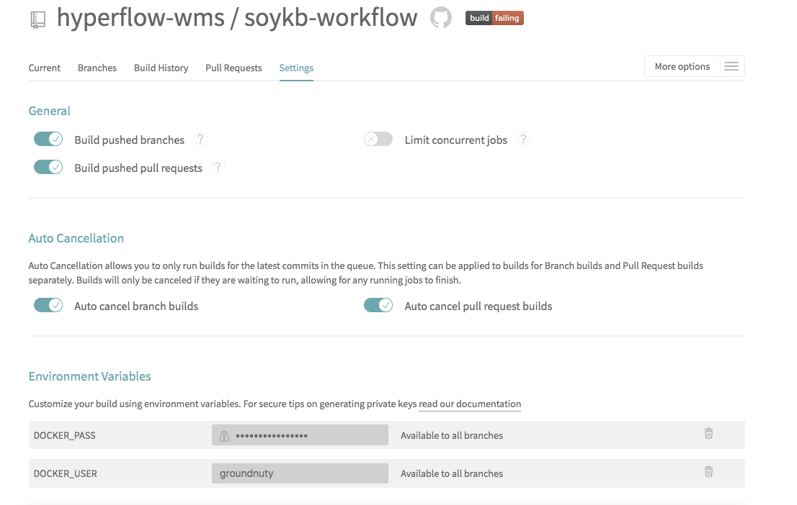
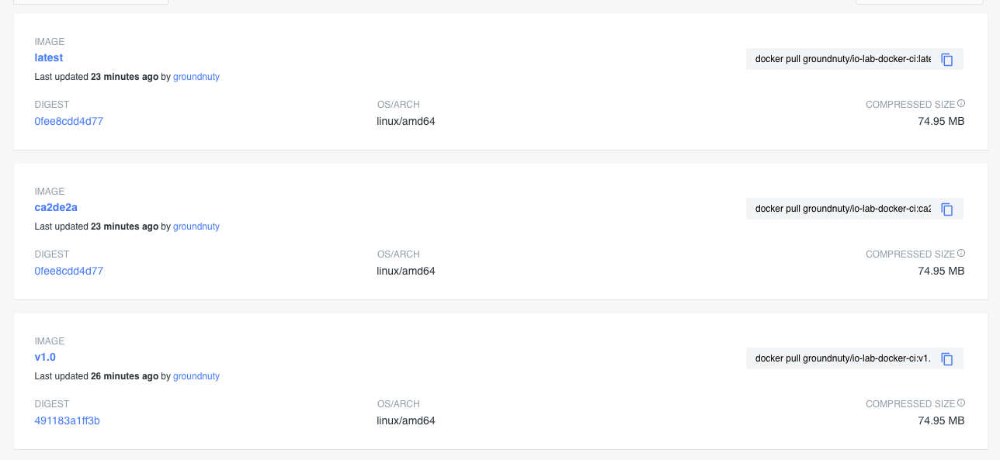

# Docker and Travis Example

### 0. Fork this repository and clone it locally.

### 1. Familiarize yourself with the content of the repository

### 2. Build a docker image

Fill the missing `TODO-s` in the Makefile so that `make image` works.

Expected (to the extend) output of `make image`:

```bash
Sending build context to Docker daemon  6.144kB
Step 1/29 : FROM python:3.7-alpine
 ---> 7fbc871584eb
Step 2/29 : LABEL maintainer="Michal Orzechowski <morzech@agh.edu.pl>"
 ---> Using cache
 ---> 2795ee8bc8cc
Step 3/29 : ARG SCHEMA_NAME
 ---> Using cache
 ---> d0dd3adbeeb8
Step 4/29 : ARG SCHEMA_DESCRIPTION
 ---> Using cache
 ---> db64bb3a158e
Step 5/29 : ARG SCHEMA_URL
 ---> Using cache
 ---> 2445288c69eb
Step 6/29 : ARG SCEHMA_VENDOR
 ---> Using cache
 ---> 900c2ac88d0a
Step 7/29 : ARG SCHEMA_VSC_URL
 ---> Using cache
 ---> 934f053097bd
Step 8/29 : ARG SCHEMA_VCS_REF
 ---> Using cache
 ---> 00e00d258531
Step 9/29 : ARG SCHEMA_BUILD_DATE
 ---> Using cache
 ---> bf344af4214c
Step 10/29 : ARG SCHEMA_BUILD_VERSION
 ---> Using cache
 ---> 70b02377af88
Step 11/29 : ARG SCHEMA_CMD
 ---> Using cache
 ---> b8352767c1d0
Step 12/29 : LABEL org.label-schema.schema-version="1.0"
 ---> Using cache
 ---> 9e5b2681cca5
Step 13/29 : LABEL org.label-schema.name=$SCHEMA_NAME
 ---> Using cache
 ---> 029ac4e053a8
Step 14/29 : LABEL org.label-schema.description=$SCHEMA_DESCRIPTION
 ---> Using cache
 ---> d42f64a96cb0
Step 15/29 : LABEL org.label-schema.url=$SCHEMA_VSC_URL
 ---> Using cache
 ---> d7d4ebb44d5f
Step 16/29 : LABEL org.label-schema.vendor=$SCEHMA_VENDOR
 ---> Using cache
 ---> ffe6d7cd824e
Step 17/29 : LABEL org.label-schema.vcs-url=$SCHEMA_VSC_URL
 ---> Using cache
 ---> fcb78ea844b9
Step 18/29 : LABEL org.label-schema.vcs-ref=$SCHEMA_VCS_REF
 ---> Running in 4ac82329f13d
Removing intermediate container 4ac82329f13d
 ---> be6d3539a5a2
Step 19/29 : LABEL org.label-schema.build-date=$SCHEMA_BUILD_DATE
 ---> Running in b318d8f20ae3
Removing intermediate container b318d8f20ae3
 ---> 4a2f57d7001e
Step 20/29 : LABEL org.label-schema.version=$SCHEMA_BUILD_VERSION
 ---> Running in 51101b1a7f79
Removing intermediate container 51101b1a7f79
 ---> 4d6f2c9485d7
Step 21/29 : LABEL org.label-schema.docker.cmd=$SCHEMA_CMD
 ---> Running in 972ade4b46ee
Removing intermediate container 972ade4b46ee
 ---> 97bcc02577b0
Step 22/29 : WORKDIR /code
 ---> Running in 2088d5804cfc
Removing intermediate container 2088d5804cfc
 ---> 21911fd89b7f
Step 23/29 : RUN apk add --no-cache gcc musl-dev linux-headers
 ---> Running in 538c35c47832
fetch http://dl-cdn.alpinelinux.org/alpine/v3.11/main/x86_64/APKINDEX.tar.gz
fetch http://dl-cdn.alpinelinux.org/alpine/v3.11/community/x86_64/APKINDEX.tar.gz
(1/12) Installing libgcc (9.2.0-r4)
(2/12) Installing libstdc++ (9.2.0-r4)
(3/12) Installing binutils (2.33.1-r0)
(4/12) Installing gmp (6.1.2-r1)
(5/12) Installing isl (0.18-r0)
(6/12) Installing libgomp (9.2.0-r4)
(7/12) Installing libatomic (9.2.0-r4)
(8/12) Installing mpfr4 (4.0.2-r1)
(9/12) Installing mpc1 (1.1.0-r1)
(10/12) Installing gcc (9.2.0-r4)
(11/12) Installing linux-headers (4.19.36-r0)
(12/12) Installing musl-dev (1.1.24-r2)
Executing busybox-1.31.1-r9.trigger
OK: 124 MiB in 46 packages
Removing intermediate container 538c35c47832
 ---> 6126c931b172
Step 24/29 : COPY requirements.txt requirements.txt
 ---> a7570e1512ab
Step 25/29 : RUN pip install -r requirements.txt
 ---> Running in 61685c425376
Collecting flask==1.1.2
  Downloading Flask-1.1.2-py2.py3-none-any.whl (94 kB)
Collecting redis==3.4.1
  Downloading redis-3.4.1-py2.py3-none-any.whl (71 kB)
Collecting itsdangerous>=0.24
  Downloading itsdangerous-1.1.0-py2.py3-none-any.whl (16 kB)
Collecting click>=5.1
  Downloading click-7.1.1-py2.py3-none-any.whl (82 kB)
Collecting Werkzeug>=0.15
  Downloading Werkzeug-1.0.1-py2.py3-none-any.whl (298 kB)
Collecting Jinja2>=2.10.1
  Downloading Jinja2-2.11.2-py2.py3-none-any.whl (125 kB)
Collecting MarkupSafe>=0.23
  Downloading MarkupSafe-1.1.1.tar.gz (19 kB)
Building wheels for collected packages: MarkupSafe
  Building wheel for MarkupSafe (setup.py): started
  Building wheel for MarkupSafe (setup.py): finished with status 'done'
  Created wheel for MarkupSafe: filename=MarkupSafe-1.1.1-cp37-cp37m-linux_x86_64.whl size=32619 sha256=95906059256f23c308c9d3d7a50f40192f618fe0efd478d3265000f9fffdb4ad
  Stored in directory: /root/.cache/pip/wheels/b9/d9/ae/63bf9056b0a22b13ade9f6b9e08187c1bb71c47ef21a8c9924
Successfully built MarkupSafe
Installing collected packages: itsdangerous, click, Werkzeug, MarkupSafe, Jinja2, flask, redis
Successfully installed Jinja2-2.11.2 MarkupSafe-1.1.1 Werkzeug-1.0.1 click-7.1.1 flask-1.1.2 itsdangerous-1.1.0 redis-3.4.1
Removing intermediate container 61685c425376
 ---> fd46a82c81a5
Step 26/29 : ENV FLASK_APP app.py
 ---> Running in 4df23c74a148
Removing intermediate container 4df23c74a148
 ---> 3107f46592bf
Step 27/29 : ENV FLASK_RUN_HOST 0.0.0.0
 ---> Running in 59d6d67dc61b
Removing intermediate container 59d6d67dc61b
 ---> 6768684f5069
Step 28/29 : COPY . .
 ---> 0fdd5fc95b8d
Step 29/29 : CMD ["flask", "run"]
 ---> Running in 00e4ac9233fd
Removing intermediate container 00e4ac9233fd
 ---> 9947bd763e23
Successfully built 9947bd763e23
Successfully tagged groundnuty/io-lab-docker-ci:latest
```

To validate that image exists see `docker images`. Expected (to the extend) result:

```bash
REPOSITORY                           TAG                                                        IMAGE ID            CREATED             SIZE
groundnuty/io-lab-docker-ci          latest                                                     9947bd763e23        3 minutes ago       220MB
groundnuty/io-lab-docker-ci          ca2de2a                                                    b8523c85d262        6 hours ago         220MB
```

### 3. Push the image to docker hub

> (a student is granted 0.25 point for a success)
> Remember to use `docker login` to authorize with image repository first!

Fill the missing `TODO-s` in the Makefile so that 'make push' worked.

Expected (to the extend) output of `make push`:

```bash
...beginning the same as in `docker image` output```

Successfully tagged groundnuty/io-lab-docker-ci:latest
The push refers to repository [docker.io/groundnuty/io-lab-docker-ci]
c53376c17cd0: Pushed 
0e99ac6c97f1: Pushed 
03bf2b001247: Pushed 
37dac84cc918: Pushed 
f712cda604f9: Pushed 
deed50ede1d1: Layer already exists 
52c92e1df6b4: Layer already exists 
7f4ac501d7a6: Layer already exists 
d87eb7d6daff: Layer already exists 
beee9f30bc1f: Layer already exists 
latest: digest: sha256:491183a1ff3b0f8346aa8310400533c385ec45f874900f3541a3a7a1965e92f3 size: 2413
The push refers to repository [docker.io/groundnuty/io-lab-docker-ci]
c53376c17cd0: Layer already exists 
0e99ac6c97f1: Layer already exists 
03bf2b001247: Layer already exists 
37dac84cc918: Layer already exists 
f712cda604f9: Layer already exists 
deed50ede1d1: Layer already exists 
52c92e1df6b4: Layer already exists 
7f4ac501d7a6: Layer already exists 
d87eb7d6daff: Layer already exists 
beee9f30bc1f: Layer already exists 
ca2de2a: digest: sha256:491183a1ff3b0f8346aa8310400533c385ec45f874900f3541a3a7a1965e92f3 size: 2413
```

Validate the existence of images on [https://hub.docker.com](https://hub.docker.com). There should be two images present:


### 4. Fill the missing `TODO-s` in the docker-compose.yaml, so that you can run `docker-compose up` and see that an application is running on: [http://localhost:5000](http://localhost:5000).

> (a student is granted 0.25 point for a success)

- a) run the docker-compose without redis persistence - every time you start docker-compose the `application counter` should start from zero.
- b) run the docker-compose with redis persistence - every time you start docker-compose the `application counter` should start from the same value.
- c) demonstrate that you can change the displayed text in Python code and text will change itself (after refresh) on the webpage.

### 5. Fill the missing `TODO-s` in .travis.yml so `travis-ci` can build and release an application.

> (a student is granted 0.25 point for a success).

- a) on [https://travis-ci.org/account/repositories][(https://travis-ci.org/](https://travis-ci.org/account/repositories)) select your repository so that travis is able to build it
- b) on the settings page of your travis build configure the environmental variables needed for travis to push:
code 
- c) make a commit to trigger travis build - the build should be successful
- d) after committing everything and achieving successful travis build, create a github [release](https://help.github.com/en/github/administering-a-repository/managing-releases-in-a-repository) (or just create an annotated git tag and push it to the remote). Travis should be triggered and deployment of a properly tagged release should land on [https://hub.docker.com](https://hub.docker.com):


### 6. Fill the missing `TODO-s` in docker-compose-prod.yml so that you can run the newly released image in a production mode.

> (a student is granted 0.25 point for a success)


### 7.  ***IMPORTANT*** 
Present:

- link to your github repository
- link to your docker hub repository
- link do your travis build

for evaluation!